Enlace al Repositorio:
https://github.com/rramirezg18/pg-analisisdesonidos.git

# Control de versiones {.unnumbered}

| Versión | Fecha | Descripción | 
|---|---|---|
| **1** | **18/08/2026** | **Versión inicial** |

\renewcommand{\contentsname}{Índice}
\tableofcontents

\newpage

# Introducción

## Propósito

Este documento especifica los requerimientos funcionales, no funcionales, casos de uso, diseño y criterios de aceptación del sistema de detección de anomalías en motores de motocicletas.

## Alcance

Aplicación web mobile-first que permite cargar una grabación del motor de una motocicleta en ralentí y obtener un diagnóstico automatizado sobre el estado del motor, orientado a la detección de **anomalía por holgura de válvulas**.

- Motocicletas de **125, 150 y 200 cc**, motor de 4 tiempos, en ralentí.
- Clasificación binaria: **normal** vs. **anomalía por holgura de válvulas**.
- Exactitud objetivo del modelo CNN: **85 %** mínimo.
- Autenticación delegada con **OAuth 2.0** (Google, GitHub).
- Base de datos embebida **SQLite**.

**Fuera del alcance:** otras anomalías, cilindrajes fuera de rango, motor acelerado, recomendaciones de reparación.

## Glosario

| Término | Definición |
|---|---|
| CNN | Red Neuronal Convolucional. |
| Espectrograma de Mel | Representación visual tiempo-frecuencia del audio. |
| OAuth 2.0 | Estándar de autorización delegada (RFC 6749). |
| Holgura de válvulas | Separación excesiva entre vástago de válvula y balancín. |
| Ralentí | Motor encendido sin acelerador aplicado. |

# Descripción del sistema

## Usuarios

| Usuario | Descripción | Nivel técnico |
|---|---|---|
| Visitante | Accede sin autenticación. Ve información pública. | Cualquiera |
| Propietario de moto | Se autentica, realiza diagnósticos y consulta su historial. | Bajo |
| Mecánico de taller | Igual que propietario, uso frecuente con múltiples motos. | Medio |

## Entorno de operación

| Componente | Tecnología |
|---|---|
| Backend | Python 3.12, FastAPI |
| ML / Audio | TensorFlow/Keras, librosa |
| Base de datos | SQLite |
| Autenticación | OAuth 2.0 (Google, GitHub) |
| Frontend | HTML, CSS, REACT, TypeScript|
| Entrenamiento | Google Colaboratory |

## Restricciones

| ID | Restricción |
|---|---|
| RES-01 | Solo clasifica: normal vs. anomalía por holgura de válvulas. |
| RES-02 | Solo motos de 125, 150 y 200 cc, 4 tiempos, en ralentí. |
| RES-03 | Tecnologías de código abierto exclusivamente. |
| RES-04 | Sin gestión propia de contraseñas (solo OAuth 2.0). |
| RES-05 | Entrenamiento del modelo en Google Colab (plan gratuito). |
| RES-06 | Sistema funcionando el **31 de octubre de 2026**. |

# Requerimientos funcionales

| ID | Nombre | Descripción | Prioridad |
|---|---|---|---|
| RF-01 | Autenticación OAuth 2.0 | Inicio de sesión con Google o GitHub. Sin contraseñas propias. | Alta |
| RF-02 | Cierre de sesión | Invalidar sesión activa y tokens. | Media |
| RF-03 | Contenido público | Página de inicio accesible sin login con info del sistema. | Media |
| RF-04 | Formulario de datos | Marca, modelo, cilindraje (125/150/200), año, km y notas. | Alta |
| RF-05 | Validación del formulario | Marca, modelo y cilindraje obligatorios. Año y km válidos. | Alta |
| RF-06 | Carga de audio | Aceptar .wav, .mp3, .m4a hasta 20 MB. | Alta |
| RF-07 | Validación de audio | Formato, duración mínima 4 s, que no esté en silencio. | Alta |
| RF-08 | Espectrograma de Mel | Generar espectrograma de 128 bandas del audio validado. | Alta |
| RF-09 | Clasificación CNN | Aplicar modelo CNN sobre espectrograma + cilindraje. | Alta |
| RF-10 | Resultado | Mostrar clase, confianza, datos de la moto y versión CNN. | Alta |
| RF-11 | Manejo de errores | Mensajes claros sin detalles técnicos internos. | Media |
| RF-12 | Registro | Guardar en BD: usuario, moto, audio, resultado, confianza, versión CNN, fecha. | Alta |
| RF-13 | Historial | Listar diagnósticos propios, orden por fecha, con filtros. | Alta |
| RF-14 | Detalle | Ver detalle completo de un diagnóstico propio. | Media |
| RF-15 | Aislamiento de datos | Un usuario no puede ver diagnósticos de otro. | Alta |

# Requerimientos no funcionales

| ID | Categoría | Descripción | Prioridad |
|---|---|---|---|
| RNF-01 | Rendimiento | Resultado en menos de 10 s desde la carga del audio. | Alta |
| RNF-02 | Rendimiento | Soportar al menos 10 usuarios concurrentes. | Media |
| RNF-03 | Precisión | Accuracy del CNN >= 85 % en validación. | Alta |
| RNF-04 | Precisión | F1-score >= 0.80 por clase. | Alta |
| RNF-05 | Seguridad | Tokens OAuth no expuestos en URLs, logs ni respuestas. | Alta |
| RNF-06 | Seguridad | Cookies HttpOnly + Secure. Sesión expira a los 60 min. | Alta |
| RNF-07 | Seguridad | Acceso cruzado entre usuarios responde 403 o 404. | Alta |
| RNF-08 | Seguridad | Comunicación sobre HTTPS con TLS válido. | Alta |
| RNF-09 | Usabilidad | 4/5 usuarios completan diagnóstico en menos de 3 min. | Alta |
| RNF-10 | Usabilidad | Interfaz mobile-first, controles >= 44x44 px. | Alta |
| RNF-11 | Disponibilidad | 95 % durante pruebas con usuarios. | Media |
| RNF-12 | Mantenibilidad | Código modular: auth, audio, CNN, web, datos. | Media |
| RNF-13 | Mantenibilidad | Cada diagnóstico registra versión del CNN. | Media |
| RNF-14 | Portabilidad | SQLite sin servidor de BD dedicado. | Media |
| RNF-15 | Compatibilidad | Chrome, Firefox, Edge y Safari recientes. | Media |

# Casos de uso

## Diagrama de casos de uso

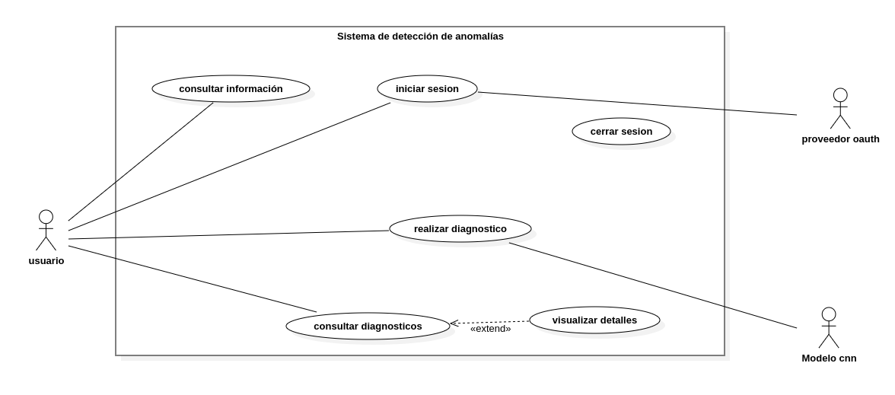{width=95%}

## Resumen

| ID | Caso de uso | Actor principal | RF relacionados |
|---|---|---|---|
| CU-01 | Consultar información del sistema | Visitante | RF-03 |
| CU-02 | Iniciar sesión con OAuth 2.0 | Usuario | RF-01 |
| CU-03 | Cerrar sesión | Usuario | RF-02 |
| CU-04 | Realizar diagnóstico de motor | Usuario | RF-04 a RF-12 |
| CU-05 | Consultar historial | Usuario | RF-13, RF-15 |
| CU-06 | Visualizar detalle | Usuario | RF-14, RF-15 |

## CU-01. Consultar información del sistema

**Precondiciones:** acceso desde un navegador.

| # | Actor | Acción |
|---|---|---|
| 1 | Visitante | Accede a la página de inicio. |
| 2 | Sistema | Muestra contenido sobre CNN, espectrogramas y flujo del diagnóstico. |
| 3 | Sistema | Ofrece opciones de inicio de sesión. |

## CU-02. Iniciar sesión con OAuth 2.0

**Precondiciones:** cuenta activa en Google o GitHub.

| # | Actor | Acción |
|---|---|---|
| 1 | Usuario | Selecciona "Iniciar sesión". |
| 2 | Sistema | Muestra opciones de proveedores OAuth. |
| 3 | Usuario | Selecciona proveedor e ingresa credenciales. |
| 4 | Proveedor | Devuelve código de autorización. |
| 5 | Sistema | Valida token, obtiene perfil, crea/actualiza usuario, establece sesión. |

**Alterno 1:** usuario cancela → regresa a inicio. **Alterno 2:** token inválido → muestra error.

## CU-03. Cerrar sesión

| # | Actor | Acción |
|---|---|---|
| 1 | Usuario | Selecciona "Cerrar sesión". |
| 2 | Sistema | Invalida sesión y tokens. Redirige a inicio. |

## CU-04. Realizar diagnóstico de motor

**Precondiciones:** usuario autenticado, modelo CNN desplegado.

| # | Actor | Acción |
|---|---|---|
| 1 | Usuario | Accede a "Nuevo diagnóstico". |
| 2 | Sistema | Muestra formulario de datos de la moto. |
| 3 | Usuario | Completa formulario y confirma. |
| 4 | Sistema | Valida datos. *(alt. 1: inválidos → resalta errores, regresa a 3)* |
| 5 | Sistema | Muestra sección de carga/grabación de audio. |
| 6 | Usuario | Carga o graba audio (.wav/.mp3/.m4a). |
| 7 | Sistema | Valida audio. *(alt. 2: inválido → error, regresa a 6)* |
| 8 | Sistema | Genera espectrograma de Mel. |
| 9 | Sistema | Aplica CNN (espectrograma + cilindraje). *(alt. 3: error → mensaje genérico)* |
| 10 | Sistema | Muestra resultado: clase, confianza, datos de la moto. |
| 11 | Sistema | Registra diagnóstico en BD. |

## CU-05. Consultar historial

| # | Actor | Acción |
|---|---|---|
| 1 | Usuario | Accede a "Historial". |
| 2 | Sistema | Muestra diagnósticos propios, orden por fecha descendente. |
| 3 | Usuario | Puede filtrar por marca, cilindraje o resultado. |

**Alterno:** sin diagnósticos → mensaje "Aún no tienes diagnósticos".

## CU-06. Visualizar detalle

| # | Actor | Acción |
|---|---|---|
| 1 | Usuario | Selecciona un diagnóstico del historial. |
| 2 | Sistema | Verifica que pertenece al usuario. *(alt: ajeno → "No autorizado")* |
| 3 | Sistema | Muestra detalle: moto, resultado, confianza, CNN, fecha, audio. |

# Análisis y diseño

## Arquitectura

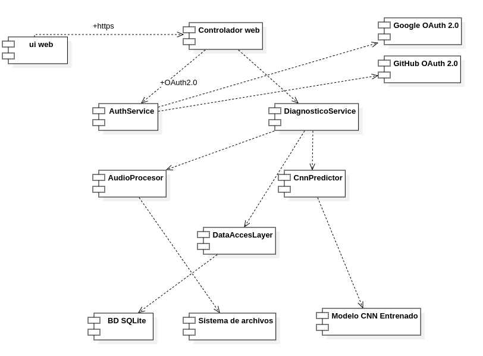{width=95%}

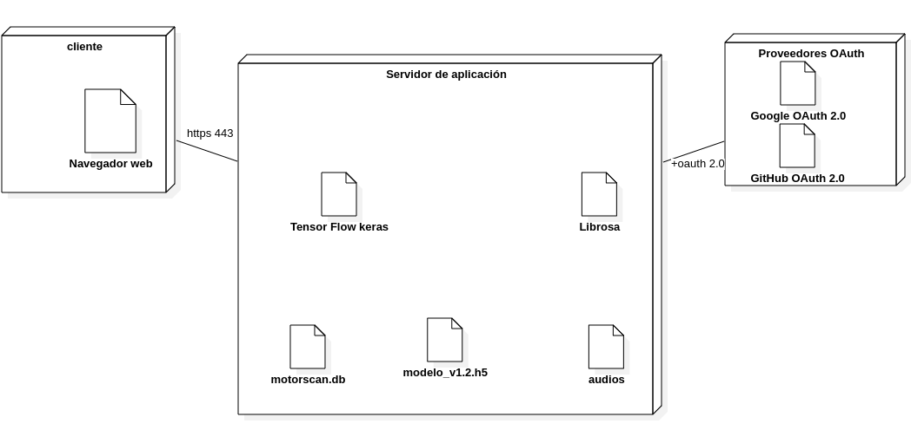{width=95%}

## Modelo de datos

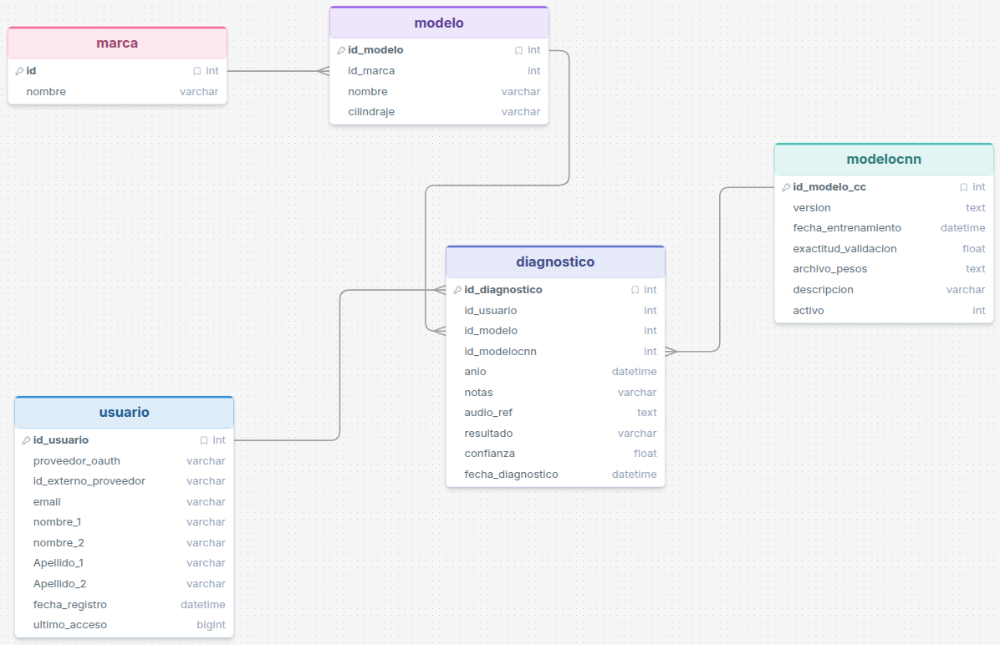{width=95%}

**Usuario:** `id_usuario` (PK), `proveedor_oauth`, `id_externo_proveedor`, `email` (UK), `nombre`, `fecha_registro`, `ultimo_acceso`.

**Marca:** `id_marca` (PK), `nombre` (UK).

**Modelo:** `id_modelo` (PK), `id_marca` (FK), `nombre`, `cilindraje` (125/150/200).

**ModeloCNN:** `id_modelo_cnn` (PK), `version` (UK), `fecha_entrenamiento`, `exactitud_validacion`, `archivo_pesos`, `descripcion`, `activo`.

**Diagnostico:** `id_diagnostico` (PK), `id_usuario` (FK), `id_modelo` (FK), `id_modelo_cnn` (FK), `anio`, `kilometraje`, `notas`, `audio_ref`, `resultado`, `confianza`, `fecha_diagnostico`.

## Diagrama de clases

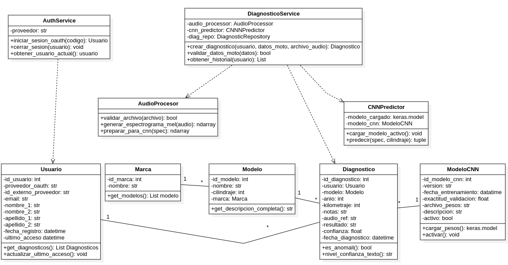{width=95%}

## Diagramas dinámicos

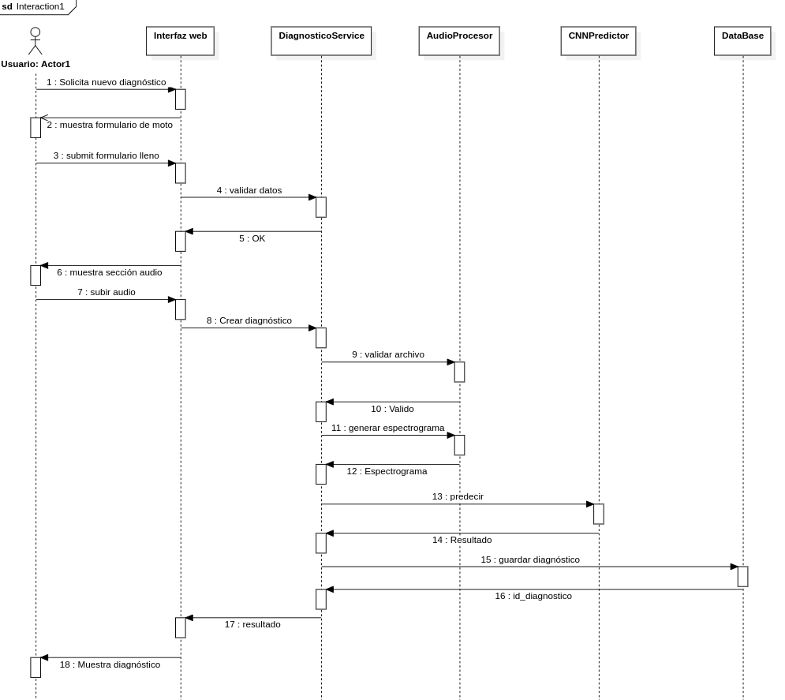{width=95%}

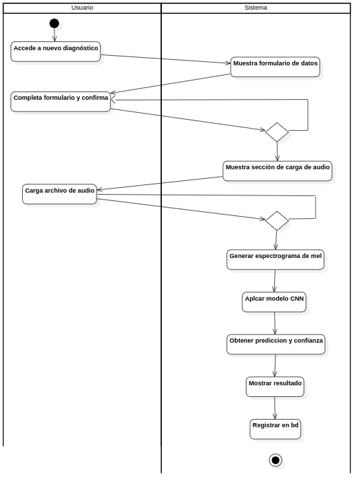{width=85%}

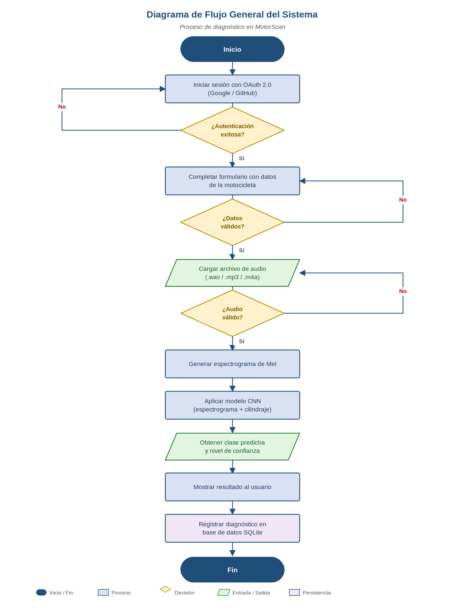{width=75%}

## Mockups

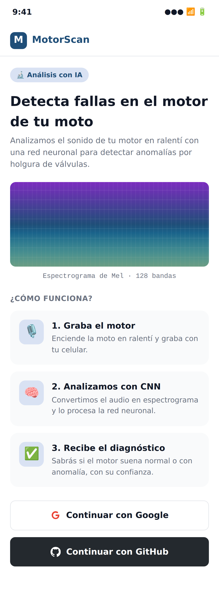{width=42%}
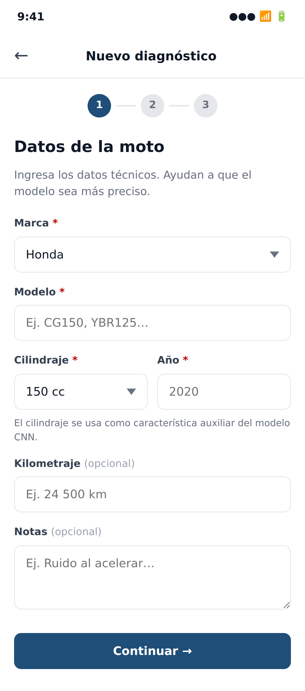{width=42%}

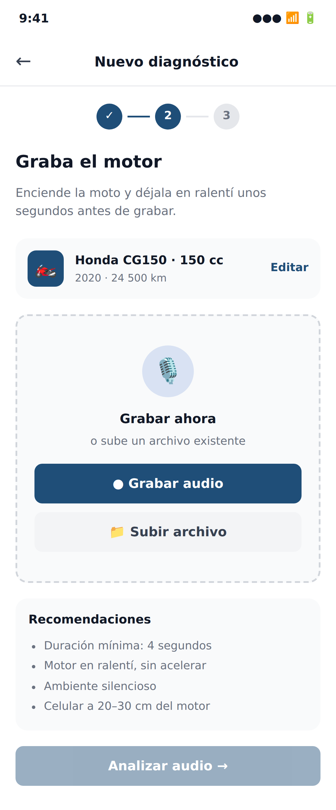{width=42%}
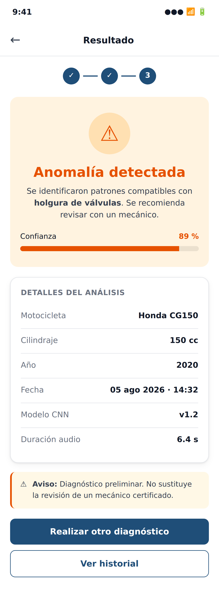{width=42%}

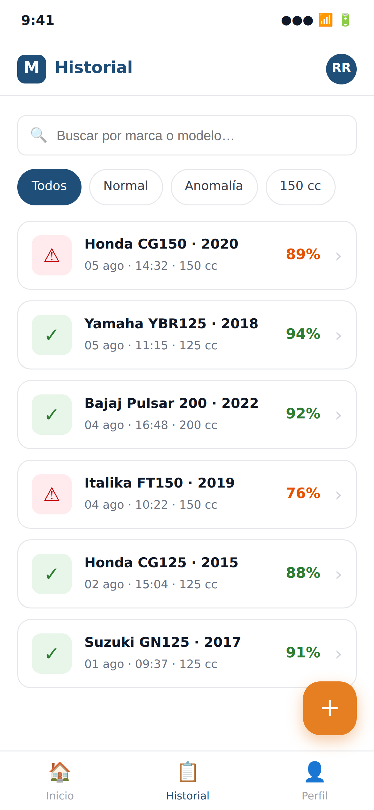{width=42%}
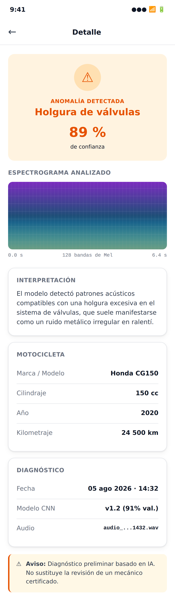{width=42%}

# Criterios de aceptación

## Por requerimiento funcional

| RF | Criterio de aceptación |
|---|---|
| RF-01 | Login con Google y GitHub funciona. Primer inicio crea usuario en BD. |
| RF-02 | Cerrar sesión invalida cookies. Rutas protegidas redirigen al login. |
| RF-03 | Página de inicio accesible sin login con info sobre CNN y flujo. |
| RF-04 | Formulario muestra todos los campos. Obligatorios marcados. |
| RF-05 | Campos faltantes o fuera de rango muestran error y no dejan avanzar. |
| RF-06 | Acepta .wav, .mp3, .m4a hasta 20 MB. Rechaza otros formatos. |
| RF-07 | Rechaza audios corruptos, < 4 s, o en silencio con mensaje específico. |
| RF-08 | Genera espectrograma de 128 bandas normalizado. |
| RF-09 | CNN devuelve clase válida y confianza entre 0 y 100. |
| RF-10 | Resultado muestra clase, confianza, datos de la moto y versión CNN. |
| RF-11 | Mensajes de error comprensibles, sin trazas técnicas. |
| RF-12 | Diagnóstico guardado con los 11 campos definidos. |
| RF-13 | Historial solo con diagnósticos propios, orden descendente, filtros ok. |
| RF-14 | Detalle muestra todos los datos incluyendo versión del CNN. |
| RF-15 | Acceso a diagnóstico ajeno devuelve 403 o 404. |

## Por requerimiento no funcional

| RNF | Criterio | Verificación |
|---|---|---|
| RNF-01 | Resultado en 10 s o menos. | Prueba con 20 audios. |
| RNF-03 | Accuracy >= 85 %. | Evaluación en validación. |
| RNF-04 | F1 >= 0.80 por clase. | sklearn.metrics. |
| RNF-05 | Tokens no expuestos. | Revisión de logs. |
| RNF-07 | Acceso cruzado rechazado. | Prueba con 2 usuarios. |
| RNF-09 | 4/5 usuarios en < 3 min. | Prueba cronometrada. |

## Trazabilidad

| RF | Caso de uso | Criterio |
|---|---|---|
| RF-01 | CU-02 | CA-RF-01 |
| RF-02 | CU-03 | CA-RF-02 |
| RF-03 | CU-01 | CA-RF-03 |
| RF-04 a RF-12 | CU-04 | CA-RF-04 a 12 |
| RF-13, RF-15 | CU-05 | CA-RF-13, 15 |
| RF-14, RF-15 | CU-06 | CA-RF-14, 15 |

# Cronograma

| Hito | Fase del Ciclo de Vida | Descripción | Fecha Límite |
|---|---|---|---|
| Hito 1 | Análisis y Diseño | Requerimientos, casos de uso, diagramas UML, mockups y diseño de la base de datos. | 1 de agosto de 2026 |
| Hito 2 | Desarrollo — Backend y Frontend | API, base de datos e interfaz web construidas y funcionando (sin el modelo CNN integrado). | 15 de agosto de 2026 |
| Hito 3 | Desarrollo — Modelo CNN | Recolección y preparación de audio, entrenamiento del modelo CNN y evaluación de métricas (accuracy ≥ 85 %). | 20 de septiembre de 2026 |
| Hito 4 | Integración y Pruebas | Integración del modelo CNN al sistema. Pruebas funcionales, de integración y de usabilidad. Corrección de errores. | 17 de octubre de 2026 |
| Hito 5 | Despliegue | Sistema 100 % implementado y funcionando en producción. | 31 de octubre de 2026 |

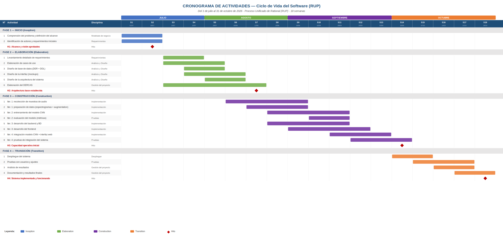{width=100%}

# Gestión de riesgos

| ID | Riesgo | Prob. | Impacto | Mitigación |
|---|---|---|---|---|
| RIE-01 | CNN no alcanza 85 %. | Media | Alto | Data augmentation, hiperparámetros, arquitecturas alternativas. |
| RIE-02 | Muestras de audio insuficientes. | Alta | Alto | Dataset público MIMII. Recolectar desde semana 3. |
| RIE-03 | Colab agota GPU. | Media | Medio | Optimizar pipeline. Checkpoints frecuentes. |
| RIE-04 | Rendimiento insuficiente en servidor. | Media | Medio | Pruebas tempranas. Modelo más ligero si necesario. |
| RIE-05 | Retraso en frontend. | Media | Medio | Priorizar flujo principal (CU-04). |